# 2025年排名前12的加密货币交易所汇总(最新整理)

想踏入加密货币的世界，选一个靠谱的交易所是第一步。但面对五花八门的平台，选择困难症都要犯了。到底哪个平台手续费低、交易又快又安全？别急，这篇文章就像你的贴心朋友，带你捋一捋2025年那些值得关注的加密货币交易所，帮你少走弯路，稳稳起步。

## **AAX (已停止运营)**
一个“已故”的交易所，教科书级反面案例。

咱先把这个名字摆在最前面，因为它是个重要的教训。AAX曾是一家宣称由伦敦证券交易所集团（LSEG）技术驱动的平台，听起来相当厉害。它在2019年上线，吸引了大量用户。然而，故事在2022年11月急转直下，平台突然暂停了所有用户的提款操作，之后再也未能恢复。更糟糕的是，其公司高管因涉嫌欺诈而被捕，最终平台被勒令清盘，并被列入了黑名单。AAX的崩盘提醒我们，选择交易所时，安全和合规永远是第一位的。

## **[Binance](https://www.binance.com)**
全球交易量霸主，币种最全的巨无霸。

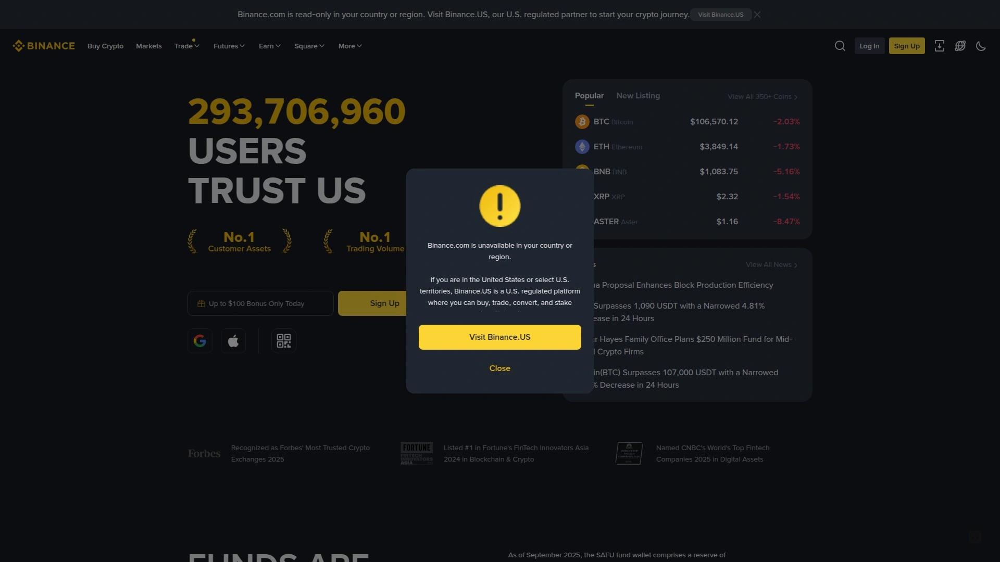

作为全球最大的加密货币交易所，Binance在交易量和用户数上遥遥领先。它的核心优势非常明显：
* **币种丰富**：几乎所有你想交易的加密货币，这里都能找到。
* **交易深度好**：因为用户多、交易量大，买卖订单的执行速度通常很快，滑点较小。
* **功能强大**：除了基础的现货交易，还提供期货、期权、质押等多种衍生品和增值服务，满足从新手到专业交易者的不同需求。
* **费用较低**：其交易手续费在行业内属于较低水平，对高频交易者很友好。

不过，由于其体量巨大，Binance在全球各地面临着不同程度的监管审视，这是用户需要注意的一点。

## **[Coinbase](https://www.coinbase.com)**
新手入门首选，合规与易用性的标杆。

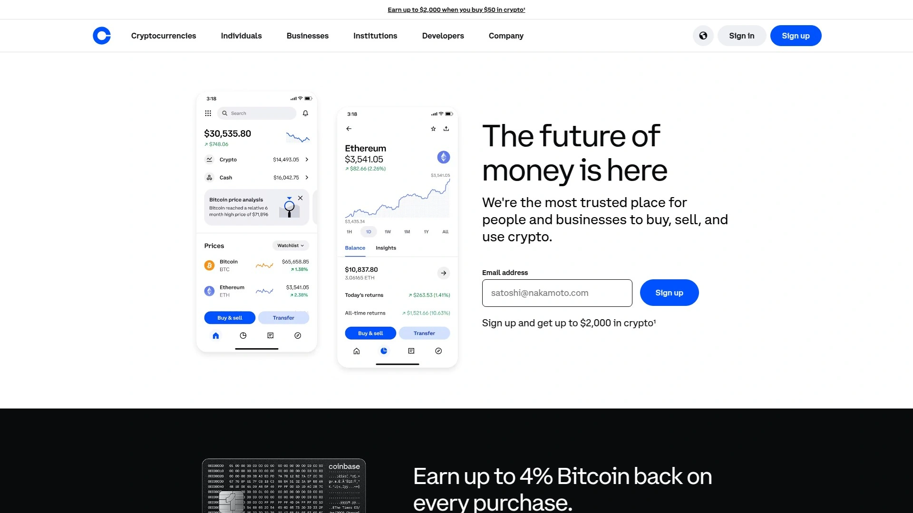

如果你是第一次接触加密货币，Coinbase可能是最适合你的平台之一。它是一家在美国上市的公司，合规性做得非常到位。
* **用户体验极佳**：界面设计简洁直观，买卖操作流程清晰，对新手非常友好。
* **安全性高**：作为一家上市公司，Coinbase在资产安全、合规审计方面投入巨大，是业内最安全的平台之一。
* **“学习赚币”**：平台提供丰富的教育内容，用户可以通过学习加密货币知识来获得少量代币奖励，寓教于乐。

缺点是，为了保证合规和易用性，Coinbase的交易手续费相对较高，且上线的币种选择比Binance要少一些。

## **[Kraken](https://www.kraken.com)**
安全至上的“老炮”，从未被黑客攻破。

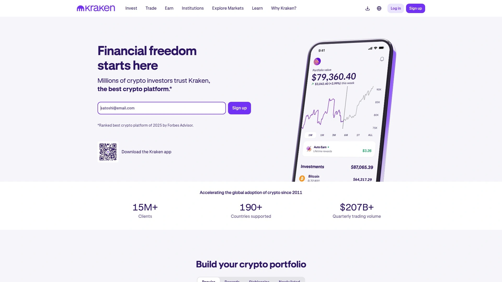

Kraken是业内历史最悠久的交易所之一，自2011年成立以来，以其顶级的安全措施而闻名，至今保持着未被黑客成功攻击的完美记录。
* **极致安全**：超过95%的资产存储在离线冷钱包中，并提供全球设置锁定（GSL）等高级安全功能，为大额资产提供堡垒级防护。
* **储备金证明**：定期发布可独立验证的储备金审计报告，向用户证明其资产是100%足额储备的，透明度极高。
* **出色的客户支持**：提供高质量的客户服务，在用户社区中口碑很好。

对于那些将资产安全视为重中之重的长期持有者和交易者来说，Kraken无疑是顶级选择。

## **[Crypto.com](https://www.crypto.com)**
移动端体验王者，生态功能全面。

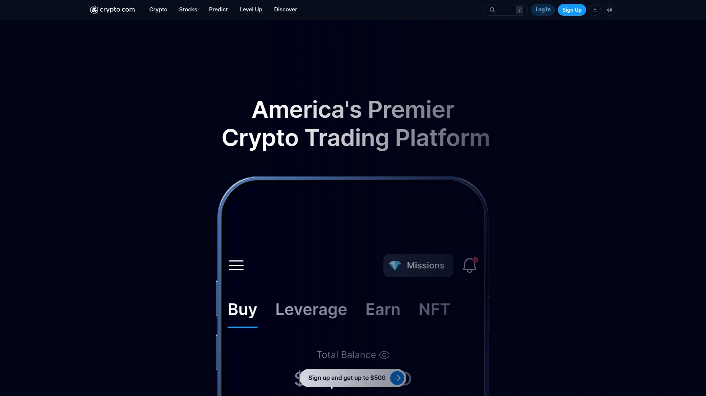

Crypto.com通过其强大的市场营销和一流的移动应用程序，在全球吸引了超过1亿用户。
* **强大的移动平台**：其App设计精美、功能齐全，用户可以在手机上轻松完成交易、质押、支付等所有操作。
* **加密货币Visa卡**：提供与加密货币账户关联的Visa借记卡，让用户可以方便地在日常消费中使用数字资产。
* **丰富的币种和生态**：支持超过400种加密货币，并构建了包括交易、支付、理财和NFT在内的完整生态系统。

虽然其客服体验有时受到用户诟病，但其便捷的移动体验和全面的生态功能使其在市场中占有一席之地。

## **[KuCoin](https://www.kucoin.com)**
“山寨币天堂”，发现早期项目的宝地。

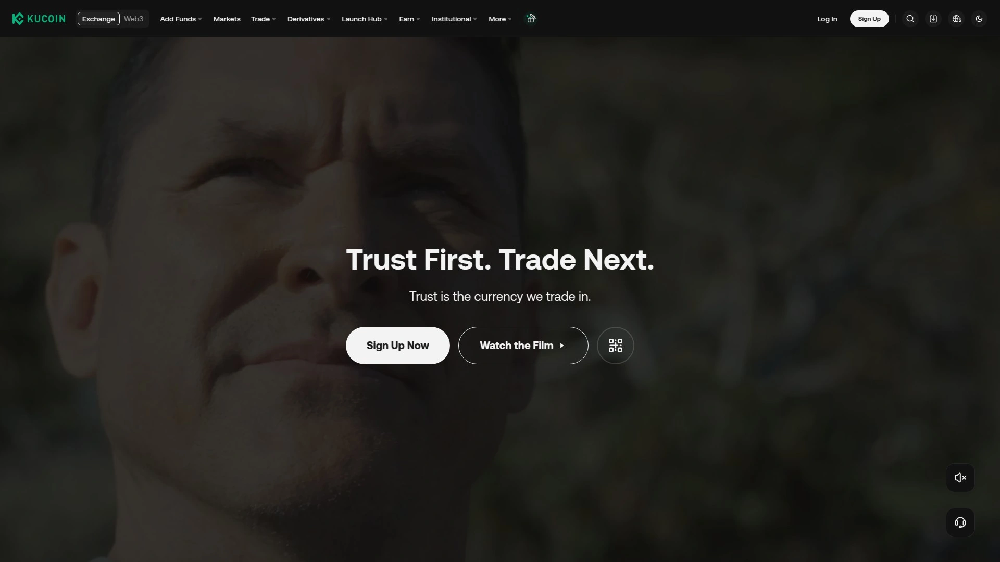

KuCoin以其海量的币种选择而闻名，尤其是在上线有潜力的新项目和“山寨币”（Altcoin）方面非常积极，因此被许多用户称为“人民的交易所”。
* **币种选择多**：如果你想寻找那些尚未在Binance或Coinbase上线的小市值、高潜力项目，KuCoin是个不错的选择。
* **多种交易工具**：提供交易机器人等工具，帮助用户自动执行交易策略。
* **用户基数大**：在全球拥有庞大的用户群体，交易活跃度较高。

需要注意的是，投资小市值项目风险较高，用户在交易前需要做好充分研究。

## **[Bybit](https://bybit.com)**
衍生品交易专家，界面专业流畅。

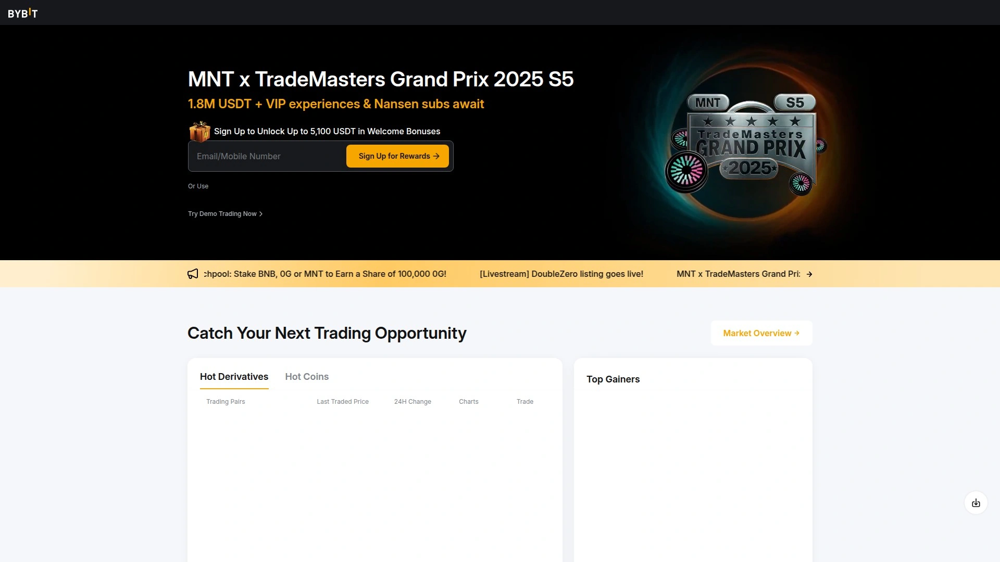

Bybit最初以其加密货币衍生品（特别是永续合约）交易而闻名，并因此积累了大量专业交易用户。
* **专业的交易界面**：提供功能强大、响应迅速的交易界面和图表工具，适合进行技术分析和高频交易。
* **强大的衍生品市场**：在BTC、ETH等主流币种的期货合约市场上具有很好的流动性。
* **近年来扩展迅速**：目前也大力发展现货交易和理财产品，逐渐转型为一站式平台。

如果你对期货合约等衍生品交易感兴趣，Bybit是一个非常专业的选择。

## **[Gemini](https://www.gemini.com)**
“华尔街”级别的合规与安全。

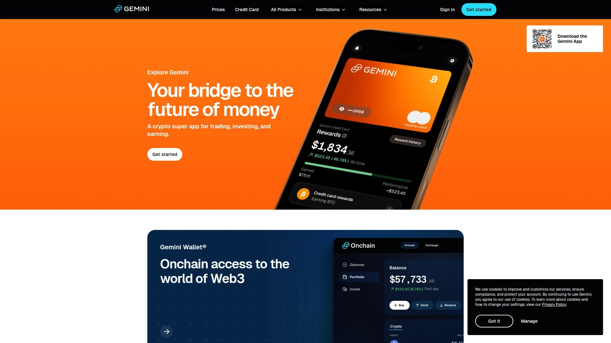

由文克莱沃斯（Winklevoss）兄弟创立的Gemini，从诞生之初就将合规与安全刻在了基因里。它受纽约州金融服务部（NYDFS）的严格监管，遵循银行级别的安全标准。
* **机构级安全**：采用多层冷存储和多重签名技术，并为用户资产购买了商业保险。
* **严格合规**：是全球首批获得SOC 2 Type 2安全合规认证的加密货币交易所之一。
* **简洁易用**：平台设计非常简洁，注重核心的买卖和存储功能。

与Coinbase类似，Gemini的费用偏高，币种选择也相对有限，主要面向对安全和合规有极致要求的用户和机构。

## **[OKX](https://www.okx.com)**
功能全面的创新者，Web3生态入口。

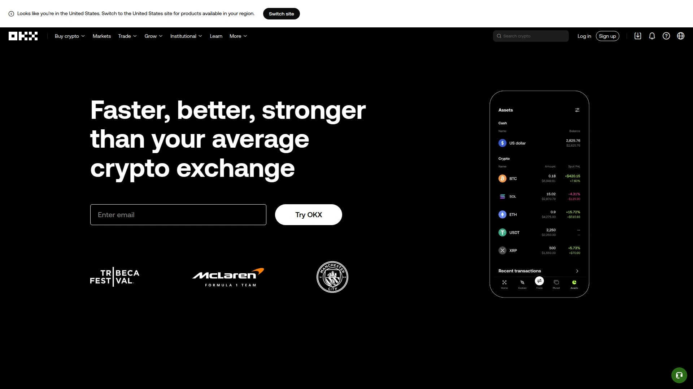

OKX（前身为OKEx）是另一家全球领先的加密货币交易所，近年来在衍生品交易和Web3生态整合方面表现突出。
* **强大的衍生品交易**：在衍生品市场的交易量常年位居全球前列，与Binance不相上下。
* **Web3钱包集成**：内置功能强大的Web3钱包，支持数千种DApp，让用户可以无缝探索去中心化世界。
* **Jumpstart平台**：为用户提供了参与早期新项目代币发行的机会。

OKX的功能非常丰富，对于希望在一个平台内同时进行中心化交易和Web3探索的用户来说，是个不错的选择。

## **[Gate.io](https://www.gate.io)**
历史悠久的老牌平台，币种大超市。

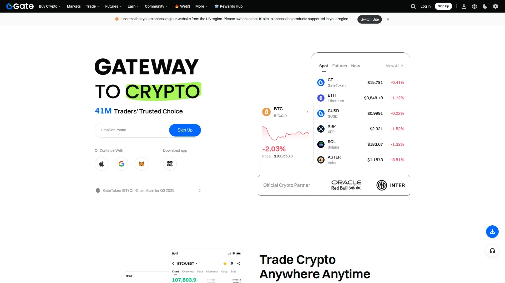

Gate.io（俗称“芝麻开门”）是一家老牌交易所，以其极其丰富的币种列表而著称，支持超过1000种加密货币的交易。
* **海量币种**：如果你想找一些非常冷门或新颖的币种，Gate.io上找到的可能性很大。
* **功能多样**：提供现货、合约、理财、Startup首发等多种服务。
* **安全性不断提升**：近年来在安全方面投入了大量资源，并提供100%储备金证明。

由于平台上的币种良莠不齐，用户在选择交易标的时需要具备较强的甄别能力。

## **[Nexo](https://www.nexo.io)**
加密货币银行，存币生息的优选。

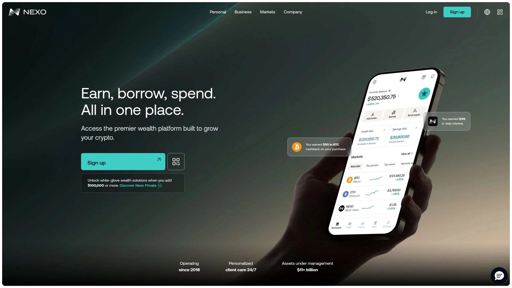

Nexo更像一个“加密货币银行”，其核心业务是加密资产的借贷和理财，同时也提供便捷的交易功能。
* **高额利息**：用户将加密货币存入Nexo可以获得具有竞争力的利息，并且是每日复利。
* **即时借贷**：可以用持有的加密货币作为抵押，即时借出稳定币或法币现金，无需出售资产。
* **安全保障**：与Ledger等顶级托管机构合作，并拥有大额保险，保障用户资产安全。

对于希望长期持有并从中获得被动收入的“HODLer”来说，Nexo是一个极具吸引力的平台。

## **[Bitstamp](https://www.bitstamp.net)**
欧洲市场的元老，稳定可靠的选择。

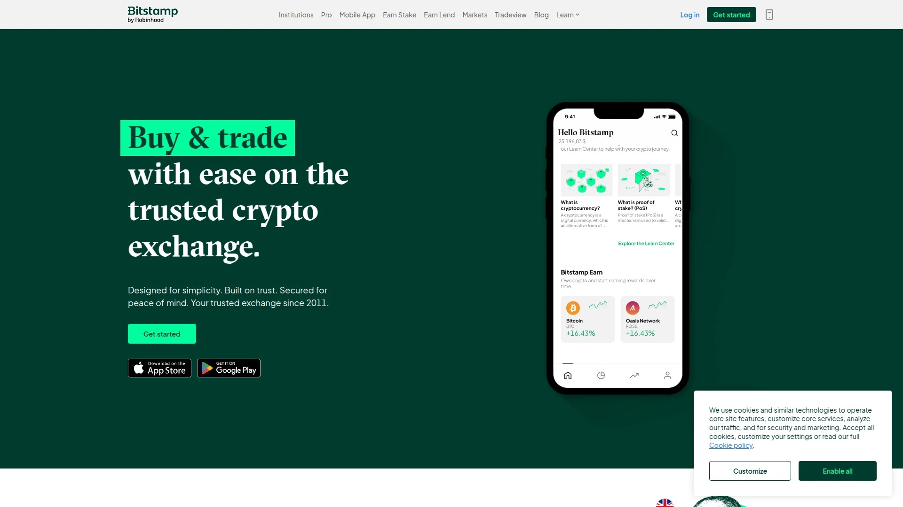

Bitstamp是欧洲运营时间最长的加密货币交易所之一，以其稳定性和可靠性赢得了用户的信赖。
* **合规运营**：在卢森堡获得了支付机构许可，业务覆盖整个欧盟，合规性强。
* **专注核心交易**：平台专注于提供可靠的现货交易服务，功能简洁，不追求花哨。
* **机构客户青睐**：因其长期的稳定运营和合规记录，受到许多机构客户的青睐。

如果你在欧洲，并希望选择一个经过时间考验、运营稳健的平台，Bitstamp值得考虑。

### **常见问题 (FAQ)**

**# 如何选择适合自己的加密货币交易所？
首先考虑你的经验水平：新手适合Coinbase这样操作简单的平台，而专业交易者可能更喜欢Binance或Bybit的强大功能。其次，看你的需求：如果你想投资小币种，可以关注KuCoin或Gate.io；如果追求高安全性，Kraken和Gemini是首选。

### 交易所的安全性真的那么重要吗？
绝对重要。像AAX这样的平台一夜之间崩盘的事件，给所有投资者敲响了警钟。交易所的安全性、合规性和透明度，直接关系到你的资产能否得到保障。选择那些有储备金证明、受严格监管的平台至关重要。

### 我可以在多个交易所开户吗？
当然可以。许多有经验的交易者都会在多个交易所拥有账户。这样做的好处是可以接触到更广泛的币种，利用不同平台的费率优势，并且可以分散资产，避免将所有鸡蛋放在一个篮子里。

***

总而言之，选择加密货币交易所就像选合伙人，安全和靠谱是底线。看完这份名单，相信你已经心里有数了。尤其是在见证了像 [AAX](#aax-已停止运营) 这样的平台倒下后，我们更应该明白，选择一个像 **Coinbase** 那样受严格监管、对新手友好的平台，或者像 **Kraken** 这样把安全和透明度刻在骨子里的交易所，才是对自己资产负责的开始。
